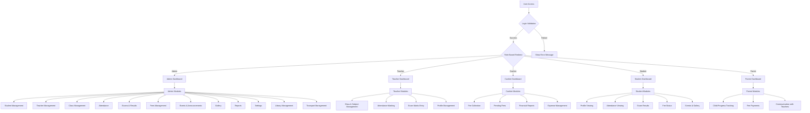
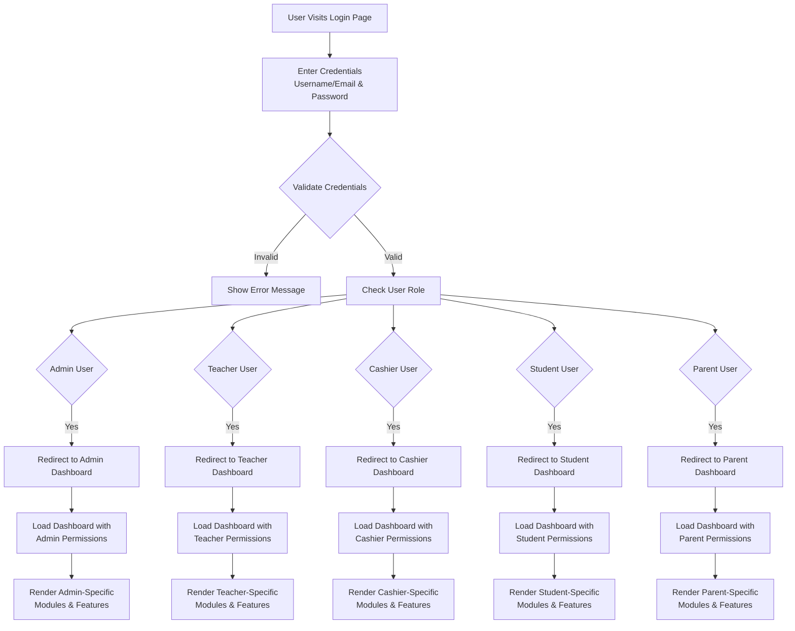
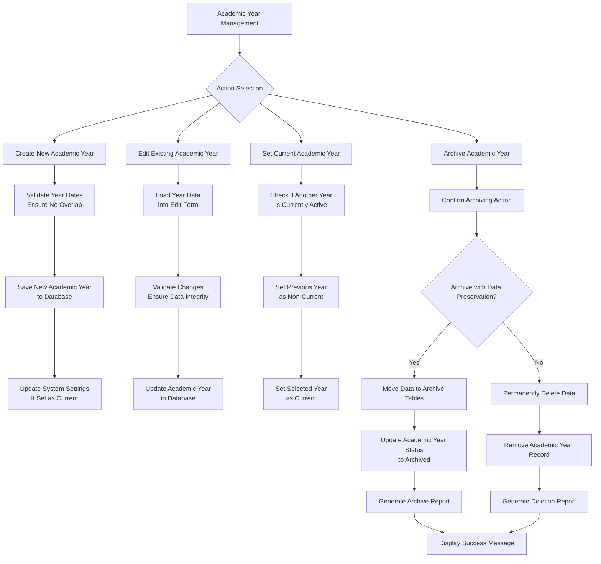
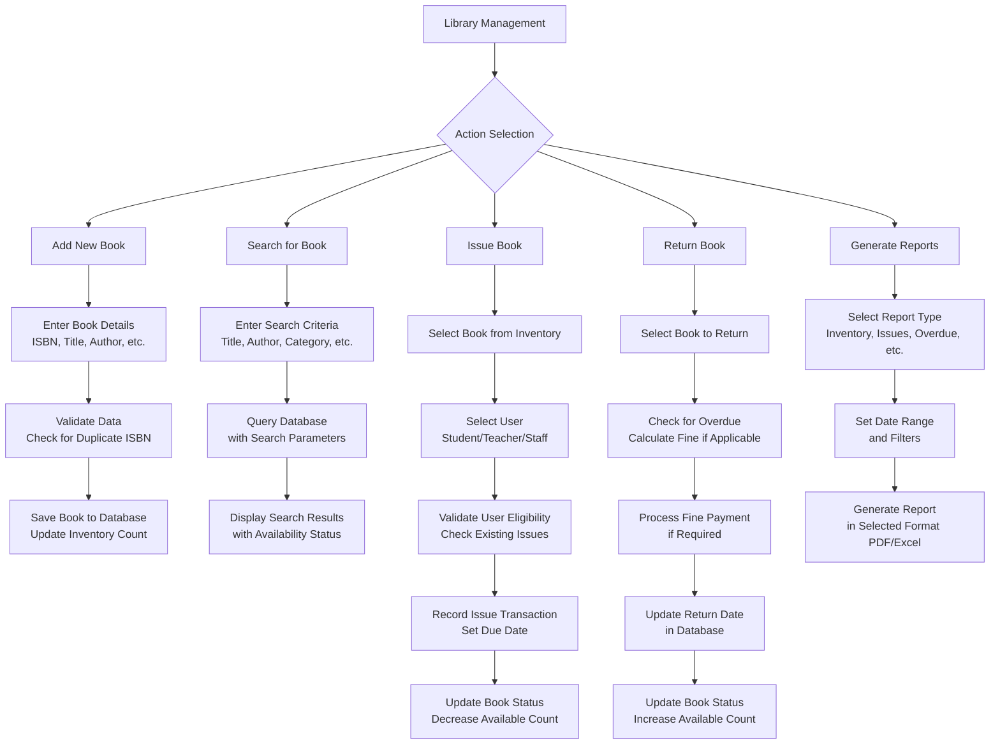
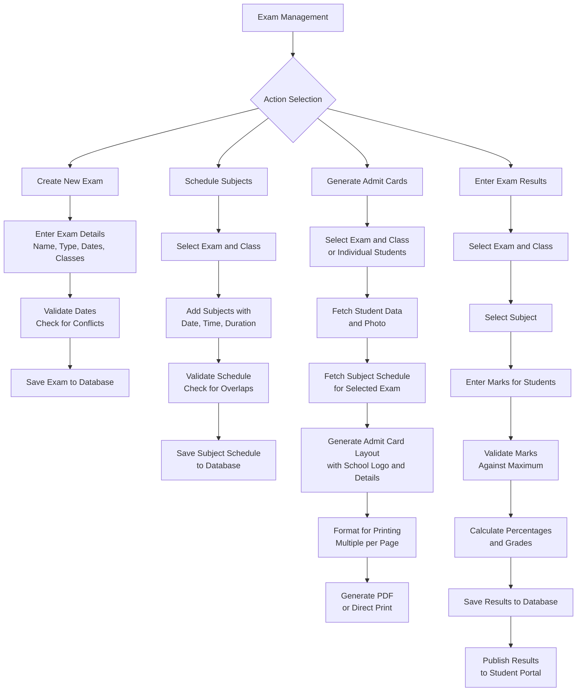
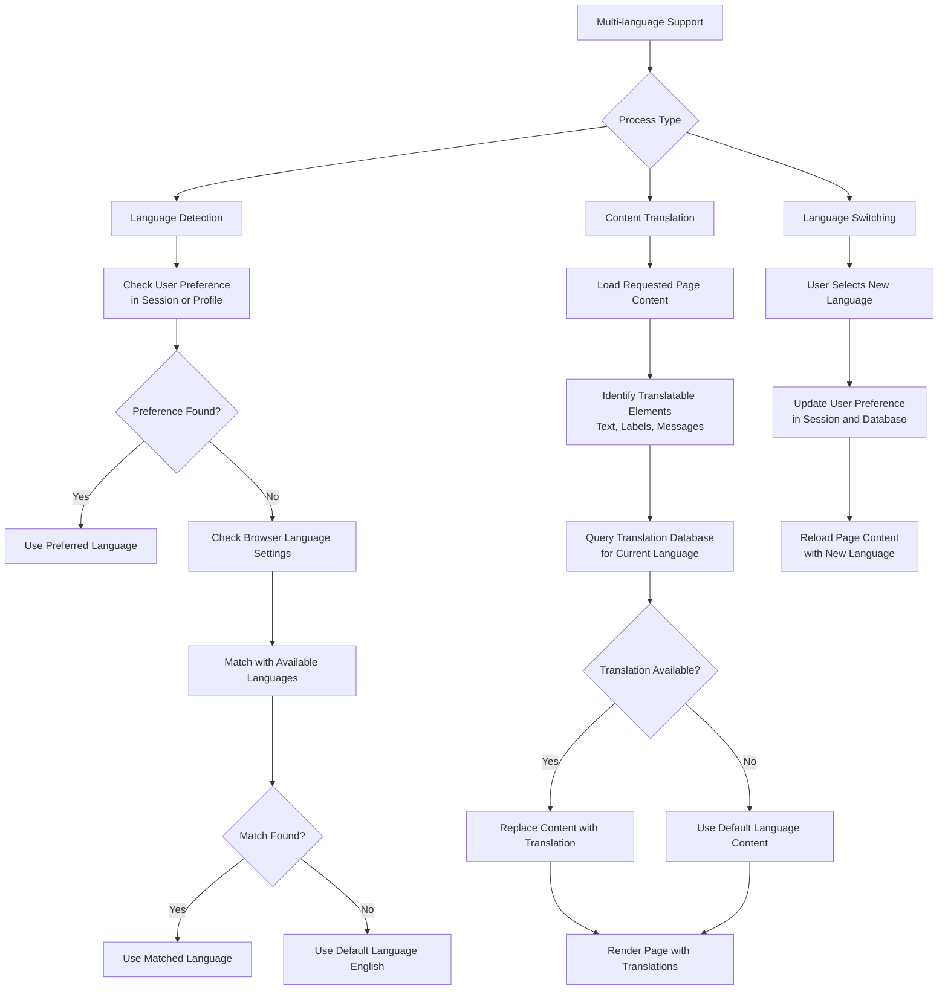
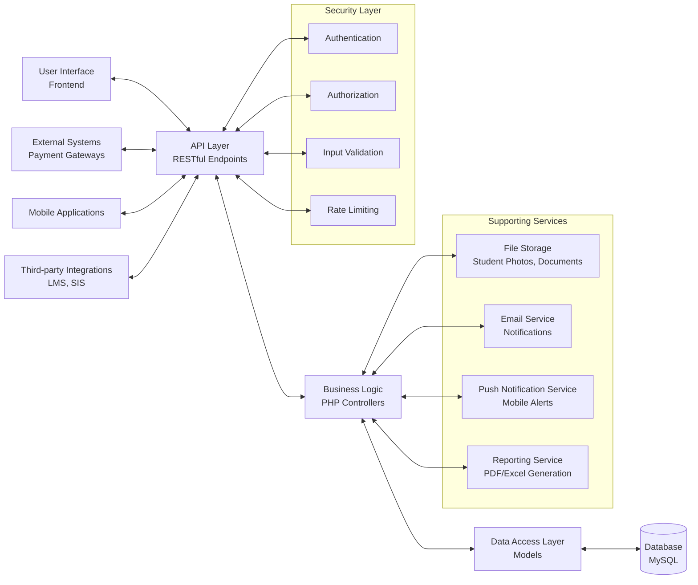

School Management System - Complete Documentation

```markdown
# School Management System

## Table of Contents
1. [System Overview](#system-overview)
2. [Architecture](#architecture)
3. [Database Design](#database-design)
4. [API Endpoints](#api-endpoints)
5. [Module Implementation](#module-implementation)
6. [Academic Year Management](#academic-year-management)
7. [Security Considerations](#security-considerations)
8. [Deployment Instructions](#deployment-instructions)
9. [Enhanced Features](#enhanced-features)

## System Overview

The School Management System is a comprehensive web application designed to manage all aspects of a school's operations. It features role-based access for administrators, teachers, cashiers, students, and parents, with each role having specific permissions and capabilities.

### Key Features
- Academic year-based data management with archiving capabilities
- Responsive design using Tailwind CSS and Bootstrap
- RESTful API architecture for web and mobile compatibility
- Dynamic homepage content management
- Comprehensive administrative controls
- Financial management with fee tracking
- Exam management with admit card generation
- Attendance tracking for students and teachers
- Role-based permissions system
- Library management system
- Transport management system
- Multi-language support
- Real-time notifications
- Document management system

## Architecture

### Technology Stack
- **Backend**: PHP 8.x
- **Database**: MySQL 8.x
- **Frontend**: HTML5, JavaScript (jQuery + Vanilla JS)
- **Styling**: Tailwind CSS + Bootstrap 5
- **Data Handling**: AJAX + RESTful APIs
```
### System Flowchart

1. User Authentication and Role-Based Access Flow



2. Academic Year Management and Archiving Process



3. Library Management Process



4. Exam Management and Admit Card Generation Process



5. Multi-language Support Implementation Process



6. Data Flow Between Modules


Database Design

Key Tables

Academic Year Management

```sql
CREATE TABLE academic_years (
    id INT PRIMARY KEY AUTO_INCREMENT,
    year_name VARCHAR(20) NOT NULL,
    start_date DATE NOT NULL,
    end_date DATE NOT NULL,
    is_current BOOLEAN DEFAULT FALSE,
    is_archived BOOLEAN DEFAULT FALSE,
    archived_at DATETIME NULL,
    created_at TIMESTAMP DEFAULT CURRENT_TIMESTAMP,
    updated_at TIMESTAMP DEFAULT CURRENT_TIMESTAMP ON UPDATE CURRENT_TIMESTAMP
);
```

Users Table (with academic year context)

```sql
CREATE TABLE users (
    id INT PRIMARY KEY AUTO_INCREMENT,
    academic_year_id INT,
    role ENUM('admin', 'teacher', 'cashier', 'student', 'parent') NOT NULL,
    username VARCHAR(100) UNIQUE NOT NULL,
    email VARCHAR(255) UNIQUE NOT NULL,
    password_hash VARCHAR(255) NOT NULL,
    first_name VARCHAR(100) NOT NULL,
    middle_name VARCHAR(100),
    last_name VARCHAR(100) NOT NULL,
    profile_picture VARCHAR(255),
    is_active BOOLEAN DEFAULT TRUE,
    remember_token VARCHAR(255),
    last_login DATETIME,
    created_at TIMESTAMP DEFAULT CURRENT_TIMESTAMP,
    updated_at TIMESTAMP DEFAULT CURRENT_TIMESTAMP ON UPDATE CURRENT_TIMESTAMP,
    FOREIGN KEY (academic_year_id) REFERENCES academic_years(id) ON DELETE SET NULL
);
```

Permissions Table

```sql
CREATE TABLE permissions (
    id INT PRIMARY KEY AUTO_INCREMENT,
    role VARCHAR(50) NOT NULL,
    module VARCHAR(100) NOT NULL,
    can_view BOOLEAN DEFAULT FALSE,
    can_create BOOLEAN DEFAULT FALSE,
    can_edit BOOLEAN DEFAULT FALSE,
    can_delete BOOLEAN DEFAULT FALSE,
    created_at TIMESTAMP DEFAULT CURRENT_TIMESTAMP,
    updated_at TIMESTAMP DEFAULT CURRENT_TIMESTAMP ON UPDATE CURRENT_TIMESTAMP,
    UNIQUE KEY unique_role_module (role, module)
);
```

Library Management Tables

```sql
CREATE TABLE library_books (
    id INT PRIMARY KEY AUTO_INCREMENT,
    isbn VARCHAR(20) UNIQUE,
    title VARCHAR(255) NOT NULL,
    author VARCHAR(255) NOT NULL,
    publisher VARCHAR(255),
    edition VARCHAR(50),
    category VARCHAR(100),
    price DECIMAL(10,2),
    quantity INT DEFAULT 1,
    academic_year_id INT,
    created_at TIMESTAMP DEFAULT CURRENT_TIMESTAMP,
    FOREIGN KEY (academic_year_id) REFERENCES academic_years(id)
);

CREATE TABLE book_issues (
    id INT PRIMARY KEY AUTO_INCREMENT,
    book_id INT NOT NULL,
    user_id INT NOT NULL,
    user_type ENUM('student', 'teacher', 'staff') NOT NULL,
    issue_date DATE NOT NULL,
    due_date DATE NOT NULL,
    return_date DATE NULL,
    fine_amount DECIMAL(10,2) DEFAULT 0,
    academic_year_id INT,
    created_at TIMESTAMP DEFAULT CURRENT_TIMESTAMP,
    FOREIGN KEY (book_id) REFERENCES library_books(id),
    FOREIGN KEY (academic_year_id) REFERENCES academic_years(id)
);
```

Transport Management Tables

```sql
CREATE TABLE transport_routes (
    id INT PRIMARY KEY AUTO_INCREMENT,
    route_name VARCHAR(100) NOT NULL,
    start_point VARCHAR(255) NOT NULL,
    end_point VARCHAR(255) NOT NULL,
    stops JSON NOT NULL,
    distance DECIMAL(5,2),
    estimated_time TIME,
    academic_year_id INT,
    created_at TIMESTAMP DEFAULT CURRENT_TIMESTAMP,
    FOREIGN KEY (academic_year_id) REFERENCES academic_years(id)
);

CREATE TABLE transport_vehicles (
    id INT PRIMARY KEY AUTO_INCREMENT,
    vehicle_number VARCHAR(20) NOT NULL UNIQUE,
    vehicle_type VARCHAR(50) NOT NULL,
    capacity INT NOT NULL,
    driver_id INT,
    route_id INT NULL,
    academic_year_id INT,
    created_at TIMESTAMP DEFAULT CURRENT_TIMESTAMP,
    FOREIGN KEY (driver_id) REFERENCES staff(id),
    FOREIGN KEY (route_id) REFERENCES transport_routes(id),
    FOREIGN KEY (academic_year_id) REFERENCES academic_years(id)
);
```

Multi-language Support Tables

```sql
CREATE TABLE languages (
    id INT PRIMARY KEY AUTO_INCREMENT,
    code VARCHAR(5) NOT NULL UNIQUE,
    name VARCHAR(50) NOT NULL,
    native_name VARCHAR(50) NOT NULL,
    is_active BOOLEAN DEFAULT TRUE,
    created_at TIMESTAMP DEFAULT CURRENT_TIMESTAMP
);

CREATE TABLE translations (
    id INT PRIMARY KEY AUTO_INCREMENT,
    key VARCHAR(255) NOT NULL UNIQUE,
    module VARCHAR(100) NOT NULL,
    description TEXT,
    created_at TIMESTAMP DEFAULT CURRENT_TIMESTAMP
);

CREATE TABLE translation_data (
    id INT PRIMARY KEY AUTO_INCREMENT,
    translation_id INT NOT NULL,
    language_code VARCHAR(5) NOT NULL,
    translation TEXT NOT NULL,
    created_at TIMESTAMP DEFAULT CURRENT_TIMESTAMP,
    UNIQUE KEY unique_translation (translation_id, language_code),
    FOREIGN KEY (translation_id) REFERENCES translations(id),
    FOREIGN KEY (language_code) REFERENCES languages(code)
);
```

Complete SQL schema is available in the database/schema.sql file.

API Endpoints

Authentication Endpoints

```
POST    /api/login          - User authentication
POST    /api/logout         - User logout
POST    /api/forgot-password- Password reset request
POST    /api/reset-password - Password reset
```

Academic Year Endpoints

```
GET     /api/academic-years          - List all academic years
POST    /api/academic-years          - Create a new academic year
GET     /api/academic-years/{id}     - Get specific academic year
PUT     /api/academic-years/{id}     - Update academic year
DELETE  /api/academic-years/{id}     - Delete/archive academic year
POST    /api/academic-years/{id}/restore - Restore archived year
POST    /api/academic-years/{id}/set-current - Set as current year
```

Student Management Endpoints

```
GET     /api/students                - List students (with filters)
POST    /api/students                - Create new student
GET     /api/students/{id}           - Get student details
PUT     /api/students/{id}           - Update student
DELETE  /api/students/{id}           - Delete student
GET     /api/students/{id}/attendance- Get student attendance
GET     /api/students/{id}/results   - Get student results
GET     /api/students/{id}/fees      - Get student fee status
```

Library Management Endpoints

```
GET     /api/library/books           - List all books
POST    /api/library/books           - Add new book
GET     /api/library/books/{id}      - Get book details
PUT     /api/library/books/{id}      - Update book
DELETE  /api/library/books/{id}      - Remove book
POST    /api/library/books/{id}/issue - Issue book to user
POST    /api/library/books/{id}/return - Return book
GET     /api/library/overdue         - Get overdue books
```

Transport Management Endpoints

```
GET     /api/transport/routes        - List all routes
POST    /api/transport/routes        - Create new route
GET     /api/transport/vehicles      - List all vehicles
POST    /api/transport/vehicles      - Add new vehicle
POST    /api/transport/assign-route  - Assign route to vehicle
GET     /api/transport/assignments   - Get vehicle assignments
GET     /api/transport/report        - Generate transport report
```

Complete API documentation is available in the API_DOCUMENTATION.md file.

Module Implementation

Academic Year Management System

Database Structure with Academic Year Context

All data tables include an academic_year_id field to associate records with specific academic years.

Archive Process

When an academic year is deleted:

1. Data is moved to archive tables with a _archive suffix
2. Relationships are maintained through original IDs
3. An archive timestamp is recorded
4. The academic year is marked as archived instead of being permanently deleted

Code Implementation

Academic Year Class (PHP)

```php
class AcademicYear {
    private $db;
    
    public function __construct($database) {
        $this->db = $database;
    }
    
    public function create($yearName, $startDate, $endDate) {
        // Ensure only one current academic year exists
        $this->db->query("UPDATE academic_years SET is_current = FALSE WHERE is_current = TRUE");
        
        return $this->db->query(
            "INSERT INTO academic_years (year_name, start_date, end_date, is_current) 
             VALUES (?, ?, ?, TRUE)",
            [$yearName, $startDate, $endDate]
        );
    }
    
    public function archive($yearId) {
        // Begin transaction
        $this->db->beginTransaction();
        
        try {
            // Archive students
            $this->db->query(
                "INSERT INTO students_archive 
                 SELECT * FROM students WHERE academic_year_id = ?",
                [$yearId]
            );
            
            // Archive other related data (teachers, attendance, fees, etc.)
            // ...
            
            // Mark academic year as archived
            $this->db->query(
                "UPDATE academic_years 
                 SET is_archived = TRUE, archived_at = NOW(), is_current = FALSE 
                 WHERE id = ?",
                [$yearId]
            );
            
            // Commit transaction
            $this->db->commit();
            return true;
        } catch (Exception $e) {
            $this->db->rollBack();
            return false;
        }
    }
    
    public function getCurrentYear() {
        return $this->db->query(
            "SELECT * FROM academic_years WHERE is_current = TRUE LIMIT 1"
        )->fetch(PDO::FETCH_ASSOC);
    }
}
```

Enhanced Academic Year Archiving Process

```php
<?php
// Enhanced AcademicYear class with better archiving
class AcademicYear {
    private $db;
    
    public function __construct($database) {
        $this->db = $database;
    }
    
    public function archiveYear($yearId) {
        // Begin transaction
        $this->db->beginTransaction();
        
        try {
            // Get academic year details
            $year = $this->db->query(
                "SELECT * FROM academic_years WHERE id = ?", 
                [$yearId]
            )->fetch(PDO::FETCH_ASSOC);
            
            if (!$year) {
                throw new Exception("Academic year not found");
            }
            
            // Create archive database if it doesn't exist
            $this->createArchiveDatabase($year['year_name']);
            
            // Archive students
            $this->archiveTable('students', $yearId, $year['year_name']);
            
            // Archive teachers
            $this->archiveTable('teachers', $yearId, $year['year_name']);
            
            // Archive attendance
            $this->archiveTable('attendance', $yearId, $year['year_name']);
            
            // Archive fees
            $this->archiveTable('fees', $yearId, $year['year_name']);
            
            // Archive exam results
            $this->archiveTable('exam_results', $yearId, $year['year_name']);
            
            // Archive other tables...
            
            // Mark academic year as archived
            $this->db->query(
                "UPDATE academic_years 
                 SET is_archived = TRUE, archived_at = NOW(), is_current = FALSE 
                 WHERE id = ?",
                [$yearId]
            );
            
            // Set a new current academic year if needed
            if ($year['is_current']) {
                $this->setNewCurrentYear();
            }
            
            // Commit transaction
            $this->db->commit();
            
            // Log the archiving process
            $this->logArchiving($yearId, true, "Academic year archived successfully");
            
            return true;
        } catch (Exception $e) {
            $this->db->rollBack();
            
            // Log error
            $this->logArchiving($yearId, false, $e->getMessage());
            
            return false;
        }
    }
    
    private function archiveTable($tableName, $yearId, $yearName) {
        $archiveDbName = "school_archive_" . preg_replace('/[^a-z0-9_]/i', '_', $yearName);
        
        // Check if table exists in archive database
        $tableExists = $this->db->query("
            SELECT COUNT(*) FROM information_schema.tables 
            WHERE table_schema = '$archiveDbName' 
            AND table_name = '$tableName'
        ")->fetchColumn();
        
        if (!$tableExists) {
            // Create table in archive database
            $createTableSql = $this->db->query("
                SHOW CREATE TABLE $tableName
            ")->fetchColumn(1);
            
            $this->db->query("USE $archiveDbName");
            $this->db->query($createTableSql);
            $this->db->query("USE " . DB_NAME); // Switch back to main database
        }
        
        // Copy data to archive database
        $this->db->query("
            INSERT INTO $archiveDbName.$tableName 
            SELECT * FROM $tableName WHERE academic_year_id = ?
        ", [$yearId]);
        
        // Remove data from main database
        $this->db->query("
            DELETE FROM $tableName WHERE academic_year_id = ?
        ", [$yearId]);
    }
    
    private function createArchiveDatabase($yearName) {
        $dbName = "school_archive_" . preg_replace('/[^a-z0-9_]/i', '_', $yearName);
        
        // Create archive database if it doesn't exist
        $this->db->query("CREATE DATABASE IF NOT EXISTS $dbName");
        
        return $dbName;
    }
    
    private function setNewCurrentYear() {
        // Find the most recent academic year that isn't archived
        $newCurrent = $this->db->query("
            SELECT id FROM academic_years 
            WHERE is_archived = FALSE 
            ORDER BY start_date DESC 
            LIMIT 1
        ")->fetchColumn();
        
        if ($newCurrent) {
            $this->db->query("
                UPDATE academic_years 
                SET is_current = TRUE 
                WHERE id = ?
            ", [$newCurrent]);
        }
    }
    
    private function logArchiving($yearId, $success, $message) {
        $this->db->query("
            INSERT INTO archive_logs 
            (academic_year_id, success, message, created_at) 
            VALUES (?, ?, ?, NOW())
        ", [$yearId, $success, $message]);
    }
    
    public function restoreArchivedYear($yearId) {
        // Implementation to restore an archived year
        // This would reverse the archiving process
        // (Complex operation that would need careful implementation)
    }
}
?>
```

Homepage Management

Dynamic Sections

· Header with configurable logo and navigation
· Image carousel with admin-managed slides
· About section with editable content
· Courses/Programs overview
· Events calendar
· Achievements showcase
· Photo gallery
· Testimonials section
· Call-to-action elements
· Footer with contact information

API Endpoints for Homepage

```
GET     /api/homepage/sections         - Get all homepage sections
PUT     /api/homepage/sections/{id}    - Update a section
GET     /api/homepage/carousel         - Get carousel images
POST    /api/homepage/carousel         - Add carousel image
DELETE  /api/homepage/carousel/{id}    - Remove carousel image
GET     /api/homepage/events           - Get upcoming events
GET     /api/homepage/testimonials     - Get testimonials
```

Role-Based Permissions System

Permission Matrix

Module Admin Teacher Cashier Student Parent
Dashboard Full View View View View
Students Full None None View (self) View (children)
Teachers Full View (assigned) None None View (assigned)
Attendance Full Manage (assigned) None View (self) View (children)
Exams Full Manage marks None View (self) View (children)
Fees Full None Full View (self) View/Pay (children)
Events Full View View View View
Gallery Full View View View View
Reports Full View (related) Financial only None View (children)
Settings Full Profile only Profile only Profile only Profile only
Library Full Manage (assigned) None View/Borrow View (children)
Transport Full None None View (self) View (children)

Permission Check Implementation

```php
class Permission {
    public static function check($userId, $module, $action) {
        // Get user role
        $user = $db->query(
            "SELECT role FROM users WHERE id = ?", 
            [$userId]
        )->fetch(PDO::FETCH_ASSOC);
        
        // Check permission
        $permission = $db->query(
            "SELECT can_{$action} as allowed 
             FROM permissions 
             WHERE role = ? AND module = ?",
            [$user['role'], $module]
        )->fetch(PDO::FETCH_ASSOC);
        
        return $permission ? (bool)$permission['allowed'] : false;
    }
    
    public static function canView($userId, $module) {
        return self::check($userId, $module, 'view');
    }
    
    public static function canCreate($userId, $module) {
        return self::check($userId, $module, 'create');
    }
    
    // Similarly for edit and delete
}
```

Student Management

Student Add Form Implementation

```javascript
// AJAX-based student addition
$('#studentAddForm').on('submit', function(e) {
    e.preventDefault();
    
    // Form validation
    if (!validateStudentForm()) {
        showError('Please fill all required fields correctly');
        return;
    }
    
    // Create FormData to handle file upload
    const formData = new FormData(this);
    
    $.ajax({
        url: '/api/students',
        type: 'POST',
        data: formData,
        processData: false,
        contentType: false,
        success: function(response) {
            showSuccess('Student added successfully');
            resetForm();
            // Optionally redirect or update student list
        },
        error: function(xhr) {
            showError('Error adding student: ' + xhr.responseJSON.message);
        }
    });
});

// Dynamic class selection
$('#class_id').on('change', function() {
    const classId = $(this).val();
    if (classId) {
        // Fetch sections for selected class
        $.get(`/api/classes/${classId}/sections`, function(sections) {
            const sectionSelect = $('#section_id');
            sectionSelect.empty().append('<option value="">Select Section</option>');
            sections.forEach(section => {
                sectionSelect.append(`<option value="${section.id}">${section.name}</option>`);
            });
        });
    }
});
```

Library Management Implementation

```php
<?php
// Library Management Controller
class LibraryController {
    private $db;
    
    public function __construct($database) {
        $this->db = $database;
    }
    
    public function addBook($bookData) {
        // Validate and add book to library
        $stmt = $this->db->prepare("INSERT INTO library_books 
            (isbn, title, author, publisher, edition, category, price, quantity, academic_year_id) 
            VALUES (?, ?, ?, ?, ?, ?, ?, ?, ?)");
        
        return $stmt->execute([
            $bookData['isbn'],
            $bookData['title'],
            $bookData['author'],
            $bookData['publisher'],
            $bookData['edition'],
            $bookData['category'],
            $bookData['price'],
            $bookData['quantity'],
            $bookData['academic_year_id']
        ]);
    }
    
    public function issueBook($issueData) {
        // Issue book to student/teacher
        $stmt = $this->db->prepare("INSERT INTO book_issues 
            (book_id, user_id, user_type, issue_date, due_date, academic_year_id) 
            VALUES (?, ?, ?, ?, ?, ?)");
        
        // Update book quantity
        $this->db->query("UPDATE library_books SET quantity = quantity - 1 WHERE id = ?", 
                        [$issueData['book_id']]);
        
        return $stmt->execute([
            $issueData['book_id'],
            $issueData['user_id'],
            $issueData['user_type'],
            $issueData['issue_date'],
            $issueData['due_date'],
            $issueData['academic_year_id']
        ]);
    }
    
    public function getOverdueBooks() {
        // Get list of overdue books
        return $this->db->query("
            SELECT bi.*, lb.title, u.first_name, u.last_name 
            FROM book_issues bi
            JOIN library_books lb ON bi.book_id = lb.id
            JOIN users u ON bi.user_id = u.id
            WHERE bi.return_date IS NULL AND bi.due_date < CURDATE()
        ")->fetchAll(PDO::FETCH_ASSOC);
    }
}
?>
```

Transport Management Implementation

```javascript
// Transport Management Frontend Component
class TransportManager {
    constructor() {
        this.initEventListeners();
        this.loadRoutes();
    }
    
    initEventListeners() {
        $('#addVehicleBtn').click(() => this.showAddVehicleModal());
        $('#assignRouteBtn').click(() => this.assignRouteToVehicle());
        $('#generateTransportReport').click(() => this.generateReport());
    }
    
    async loadRoutes() {
        try {
            const response = await fetch('/api/transport/routes');
            const routes = await response.json();
            this.renderRoutesTable(routes);
        } catch (error) {
            console.error('Error loading routes:', error);
        }
    }
    
    renderRoutesTable(routes) {
        const tableBody = $('#routesTable tbody');
        tableBody.empty();
        
        routes.forEach(route => {
            const row = `
                <tr>
                    <td>${route.route_name}</td>
                    <td>${route.start_point}</td>
                    <td>${route.end_point}</td>
                    <td>${route.stops_count}</td>
                    <td>${route.assigned_vehicle || 'Not Assigned'}</td>
                    <td>
                        <button class="btn btn-sm btn-info edit-route" data-id="${route.id}">Edit</button>
                        <button class="btn btn-sm btn-danger delete-route" data-id="${route.id}">Delete</button>
                    </td>
                </tr>
            `;
            tableBody.append(row);
        });
    }
    
    async showAddVehicleModal() {
        // Load modal with form to add vehicle
        const modal = await fetch('/transport/vehicle-form');
        $('#modalContainer').html(await modal.text());
        $('#vehicleModal').modal('show');
    }
    
    async generateReport() {
        const response = await fetch('/api/transport/report', {
            method: 'POST',
            headers: {
                'Content-Type': 'application/json'
            },
            body: JSON.stringify({
                report_type: $('#reportType').val(),
                date_range: $('#dateRange').val()
            })
        });
        
        const blob = await response.blob();
        const url = window.URL.createObjectURL(blob);
        const a = document.createElement('a');
        a.href = url;
        a.download = 'transport_report.pdf';
        document.body.appendChild(a);
        a.click();
        a.remove();
    }
}

// Initialize when document is ready
$(document).ready(() => {
    new TransportManager();
});
```

Multi-language Support Implementation

```php
<?php
// Language Manager Class
class LanguageManager {
    private $db;
    private $currentLanguage = 'en';
    private $translations = [];
    
    public function __construct($database) {
        $this->db = $database;
        $this->detectLanguage();
        $this->loadTranslations();
    }
    
    private function detectLanguage() {
        // Detect language from session, user preference, or browser
        if (isset($_SESSION['language'])) {
            $this->currentLanguage = $_SESSION['language'];
        } elseif (isset($_COOKIE['language'])) {
            $this->currentLanguage = $_COOKIE['language'];
        } else {
            $browserLang = substr($_SERVER['HTTP_ACCEPT_LANGUAGE'], 0, 2);
            $this->currentLanguage = in_array($browserLang, ['en', 'es', 'fr', 'de', 'hi']) ? 
                $browserLang : 'en';
        }
    }
    
    private function loadTranslations() {
        // Load translations from database
        $stmt = $this->db->prepare("
            SELECT t.key, td.translation 
            FROM translations t
            JOIN translation_data td ON t.id = td.translation_id
            WHERE td.language_code = ?
        ");
        $stmt->execute([$this->currentLanguage]);
        
        $this->translations = $stmt->fetchAll(PDO::FETCH_KEY_PAIR);
    }
    
    public function translate($key, $replacements = []) {
        $translation = $this->translations[$key] ?? $key;
        
        // Replace placeholders
        foreach ($replacements as $placeholder => $value) {
            $translation = str_replace("{{$placeholder}}", $value, $translation);
        }
        
        return $translation;
    }
    
    public function setLanguage($languageCode) {
        if (in_array($languageCode, ['en', 'es', 'fr', 'de', 'hi'])) {
            $this->currentLanguage = $languageCode;
            $_SESSION['language'] = $languageCode;
            setcookie('language', $languageCode, time() + (365 * 24 * 60 * 60), '/');
            $this->loadTranslations();
        }
    }
    
    public function getAvailableLanguages() {
        return $this->db->query("
            SELECT code, name, native_name 
            FROM languages 
            WHERE is_active = 1
        ")->fetchAll(PDO::FETCH_ASSOC);
    }
}

// Usage in templates:
// <?= $lang->translate('welcome_message', ['name' => $user->first_name]) 
?>
```

Exam Module Implementation

Admit Card Generation

```php
class AdmitCard {
    public function generate($examId, $studentIds = []) {
        // Get exam details
        $exam = $this->getExam($examId);
        
        // Get subject schedule
        $schedule = $this->getExamSchedule($examId);
        
        // Get students data
        $students = $this->getStudents($studentIds, $exam['class_id']);
        
        // Generate PDF
        $pdf = new PDF();
        $pdf->SetMargins(10, 10, 10);
        $pdf->AddPage();
        
        foreach ($students as $student) {
            $this->generateStudentAdmitCard($pdf, $student, $exam, $schedule);
            
            // Add page break after every 2 admit cards for A4 printing
            if (count($students) > 1) {
                $pdf->AddPage();
            }
        }
        
        return $pdf->Output('S'); // Return as string
    }
    
    private function generateStudentAdmitCard($pdf, $student, $exam, $schedule) {
        // School header with logo
        $pdf->SetFont('Arial', 'B', 16);
        $pdf->Cell(0, 10, 'SCHOOL NAME', 0, 1, 'C');
        $pdf->SetFont('Arial', 'B', 14);
        $pdf->Cell(0, 10, 'ADMIT CARD', 0, 1, 'C');
        
        // Student photo
        $pdf->Image($student['photo_path'], 160, 30, 30, 30);
        
        // Student details
        $pdf->SetFont('Arial', '', 12);
        $pdf->Cell(50, 10, 'Student Name:', 0, 0);
        $pdf->Cell(0, 10, $student['full_name'], 0, 1);
        
        // Continue with other details and subject schedule table...
    }
}
```

Enhanced API for Mobile Applications

```php
<?php
// Mobile API Controller
class MobileAPIController {
    private $db;
    
    public function __construct($database) {
        $this->db = $database;
        header('Content-Type: application/json');
    }
    
    public function studentDashboard($studentId) {
        // Get student details
        $student = $this->db->query(
            "SELECT * FROM students WHERE id = ?", 
            [$studentId]
        )->fetch(PDO::FETCH_ASSOC);
        
        // Get attendance summary
        $attendance = $this->db->query(
            "SELECT COUNT(*) as total_days, 
             SUM(CASE WHEN status = 'present' THEN 1 ELSE 0 END) as present_days 
             FROM attendance WHERE student_id = ? AND academic_year_id = ?",
            [$studentId, $this->getCurrentAcademicYear()]
        )->fetch(PDO::FETCH_ASSOC);
        
        // Get upcoming exams
        $exams = $this->db->query(
            "SELECT exam_name, exam_date FROM exams 
             WHERE class_id = ? AND exam_date >= CURDATE() 
             ORDER BY exam_date LIMIT 3",
            [$student['class_id']]
        )->fetchAll(PDO::FETCH_ASSOC);
        
        // Get fee status
        $fees = $this->db->query(
            "SELECT SUM(amount) as total_fees, 
             SUM(CASE WHEN status = 'paid' THEN amount ELSE 0 END) as paid_fees 
             FROM fees WHERE student_id = ? AND academic_year_id = ?",
            [$studentId, $this->getCurrentAcademicYear()]
        )->fetch(PDO::FETCH_ASSOC);
        
        return [
            'student' => $student,
            'attendance' => [
                'percentage' => $attendance['total_days'] > 0 ? 
                    round(($attendance['present_days'] / $attendance['total_days']) * 100, 2) : 0,
                'present' => $attendance['present_days'],
                'total' => $attendance['total_days']
            ],
            'exams' => $exams,
            'fees' => $fees
        ];
    }
    
    public function pushNotification($userId, $title, $message, $data = []) {
        // Get device tokens for user
        $tokens = $this->db->query(
            "SELECT device_token FROM user_devices WHERE user_id = ?",
            [$userId]
        )->fetchAll(PDO::FETCH_COLUMN);
        
        // Send push notifications
        $results = [];
        foreach ($tokens as $token) {
            $results[] = $this->sendFCMNotification($token, $title, $message, $data);
        }
        
        // Log notification
        $this->db->query(
            "INSERT INTO notifications (user_id, title, message, data, created_at) 
             VALUES (?, ?, ?, ?, NOW())",
            [$userId, $title, $message, json_encode($data)]
        );
        
        return $results;
    }
    
    private function sendFCMNotification($token, $title, $message, $data) {
        // Implementation for Firebase Cloud Messaging
        $url = 'https://fcm.googleapis.com/fcm/send';
        $serverKey = FCM_SERVER_KEY;
        
        $notification = [
            'title' => $title,
            'body' => $message,
            'sound' => 'default'
        ];
        
        $fields = [
            'to' => $token,
            'notification' => $notification,
            'data' => $data,
            'priority' => 'high'
        ];
        
        $headers = [
            'Authorization: key=' . $serverKey,
            'Content-Type: application/json'
        ];
        
        $ch = curl_init();
        curl_setopt($ch, CURLOPT_URL, $url);
        curl_setopt($ch, CURLOPT_POST, true);
        curl_setopt($ch, CURLOPT_HTTPHEADER, $headers);
        curl_setopt($ch, CURLOPT_RETURNTRANSFER, true);
        curl_setopt($ch, CURLOPT_POSTFIELDS, json_encode($fields));
        $result = curl_exec($ch);
        curl_close($ch);
        
        return $result;
    }
    
    private function getCurrentAcademicYear() {
        return $this->db->query(
            "SELECT id FROM academic_years WHERE is_current = 1 LIMIT 1"
        )->fetchColumn();
    }
}
?>
```

Security Considerations

1. Password Hashing: Use PHP's password_hash() with PASSWORD_DEFAULT
2. SQL Injection Prevention: Use prepared statements with PDO
3. XSS Protection: Escape output with htmlspecialchars()
4. CSRF Protection: Implement tokens for form submissions
5. File Upload Security: Validate file types and store outside web root
6. API Authentication: JWT tokens for stateless authentication
7. Role-Based Access Control: Strict permission checks on all operations

Enhanced Security Middleware

```php
<?php
// Security Middleware Class
class SecurityMiddleware {
    private $db;
    
    public function __construct($database) {
        $this->db = $database;
    }
    
    public function validateRequest($requiredPermissions = []) {
        // Check if user is authenticated
        if (!$this->isAuthenticated()) {
            $this->denyAccess("Authentication required");
        }
        
        // Check CSRF token for POST requests
        if ($_SERVER['REQUEST_METHOD'] === 'POST') {
            if (!$this->validateCSRFToken()) {
                $this->denyAccess("Invalid CSRF token");
            }
        }
        
        // Check permissions
        if (!empty($requiredPermissions)) {
            if (!$this->hasPermissions($requiredPermissions)) {
                $this->denyAccess("Insufficient permissions");
            }
        }
        
        // Rate limiting
        if (!$this->checkRateLimit()) {
            $this->denyAccess("Rate limit exceeded");
        }
        
        // Input validation
        $this->validateInput();
        
        return true;
    }
    
    private function isAuthenticated() {
        return isset($_SESSION['user_id']) && !empty($_SESSION['user_id']);
    }
    
    private function validateCSRFToken() {
        if (!isset($_POST['csrf_token']) || !isset($_SESSION['csrf_token'])) {
            return false;
        }
        
        return hash_equals($_SESSION['csrf_token'], $_POST['csrf_token']);
    }
    
    private function hasPermissions($requiredPermissions) {
        $userId = $_SESSION['user_id'];
        $userRole = $_SESSION['user_role'];
        
        // Check if user's role has the required permissions
        $stmt = $this->db->prepare("
            SELECT COUNT(*) FROM permissions 
            WHERE role = ? AND module = ? AND can_access = TRUE
        ");
        
        foreach ($requiredPermissions as $permission) {
            $stmt->execute([$userRole, $permission]);
            if ($stmt->fetchColumn() === 0) {
                return false;
            }
        }
        
        return true;
    }
    
    private function checkRateLimit() {
        $userId = $_SESSION['user_id'];
        $ipAddress = $_SERVER['REMOTE_ADDR'];
        $currentTime = time();
        $window = 60; // 1 minute window
        
        // Get request count in the time window
        $stmt = $this->db->prepare("
            SELECT COUNT(*) FROM rate_limits 
            WHERE (user_id = ? OR ip_address = ?) 
            AND timestamp > ?
        ");
        $stmt->execute([$userId, $ipAddress, $currentTime - $window]);
        $requestCount = $stmt->fetchColumn();
        
        // Check if limit exceeded
        if ($requestCount > RATE_LIMIT) {
            return false;
        }
        
        // Log this request
        $this->db->query("
            INSERT INTO rate_limits (user_id, ip_address, timestamp) 
            VALUES (?, ?, ?)
        ", [$userId, $ipAddress, $currentTime]);
        
        return true;
    }
    
    private function validateInput() {
        // Sanitize all input data
        foreach ($_GET as $key => $value) {
            $_GET[$key] = $this->sanitizeInput($value);
        }
        
        foreach ($_POST as $key => $value) {
            $_POST[$key] = $this->sanitizeInput($value);
        }
        
        foreach ($_COOKIE as $key => $value) {
            $_COOKIE[$key] = $this->sanitizeInput($value);
        }
    }
    
    private function sanitizeInput($input) {
        if (is_array($input)) {
            return array_map([$this, 'sanitizeInput'], $input);
        }
        
        // Remove whitespace
        $input = trim($input);
        
        // Strip HTML tags
        $input = strip_tags($input);
        
        // Escape special characters
        $input = htmlspecialchars($input, ENT_QUOTES, 'UTF-8');
        
        return $input;
    }
    
    private function denyAccess($message) {
        http_response_code(403);
        echo json_encode(['error' => $message]);
        exit;
    }
    
    public function generateCSRFToken() {
        if (empty($_SESSION['csrf_token'])) {
            $_SESSION['csrf_token'] = bin2hex(random_bytes(32));
        }
        
        return $_SESSION['csrf_token'];
    }
}
?>
```

Deployment Instructions

Server Requirements

· PHP 8.0 or higher
· MySQL 8.0 or higher
· Web server (Apache/Nginx)
· Composer for dependency management

Installation Steps

1. Clone the repository to your web server
2. Run composer install to install PHP dependencies
3. Create MySQL database and user
4. Import database schema from database/schema.sql
5. Configure database connection in config/database.php
6. Set up file storage permissions for uploads
7. Configure web server to point to the public directory
8. Set up SSL certificate for secure connections

File Storage Structure

```
/var/www/school-management/
├── app/
│   ├── controllers/
│   ├── models/
│   └── views/
├── config/
├── database/
├── public/
│   ├── assets/
│   │   ├── css/
│   │   ├── js/
│   │   └── images/
│   └── index.php
├── storage/
│   ├── uploads/
│   │   ├── students/
│   │   ├── teachers/
│   │   └── documents/
│   └── archives/
└── vendor/
```

Enhanced Features

1. Library Management Module

· Complete book inventory management
· Book issue and return system
· Fine calculation for overdue books
· Book reservation system
· Library reports and analytics

2. Transport Management System

· Vehicle and route management
· Driver assignment and management
· Student transport allocation
· Route optimization
· Transport fee management
· Real-time vehicle tracking integration

3. Multi-language Support

· Support for multiple languages (English, Spanish, French, German, Hindi)
· Dynamic language switching
· Database-driven translations
· Right-to-left language support (for Arabic, Hebrew, etc.)

4. Real-time Notifications

· In-app notifications
· Email notifications
· Push notifications for mobile devices
· Notification preferences per user
· Notification history and management

5. Enhanced Mobile API

· Optimized endpoints for mobile applications
· Push notification support
· Offline data synchronization
· Mobile-optimized responses
· Battery-efficient API design

6. Document Management System

· Digital document storage
· Document versioning
· Access control for documents
· Document templates
· Electronic signatures integration

7. Advanced Reporting System

· Custom report builder
· Data visualization with charts and graphs
· Scheduled report generation
· Report export in multiple formats (PDF, Excel, CSV)
· Dashboard widgets for quick insights

8. Parent Portal

· Child progress tracking
· Fee payment integration
· Communication with teachers
· Event calendar
· Attendance monitoring
· Grade book access

This documentation provides a comprehensive overview of the enhanced School Management System. For detailed implementation code, please refer to the actual source files in the repository.

```
