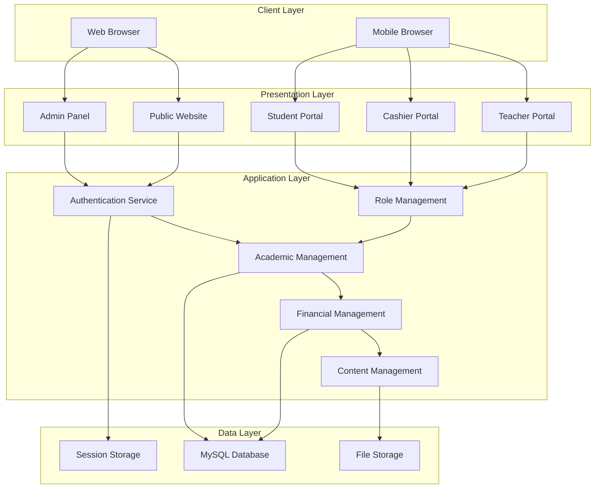
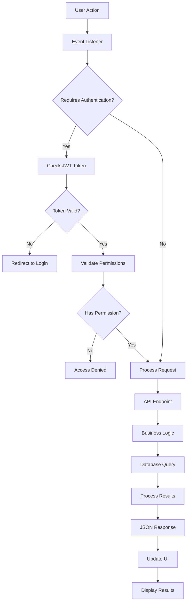
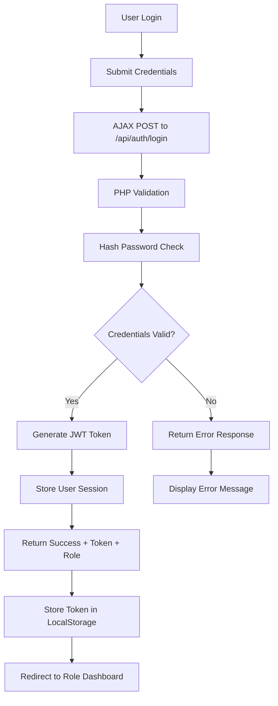
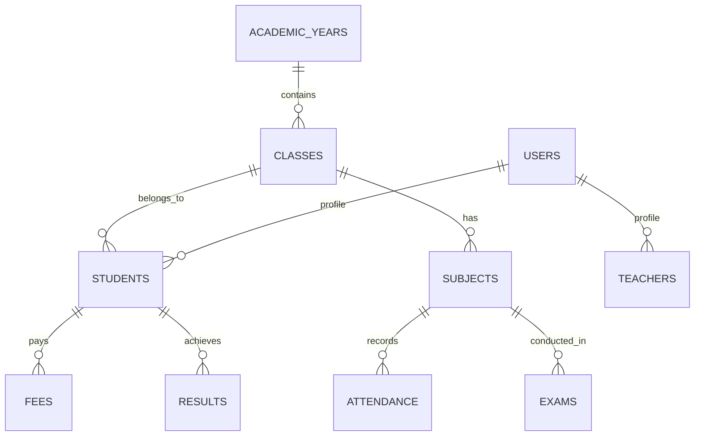

# Project Gemini: School Management System

## Table of Contents
1. [Project Overview](#1-project-overview)
2. [Technology Stack](#2-technology-stack)
3. [System Architecture](#3-system-architecture)
4. [Database Design](#4-database-design)
5. [Core Features & Modules](#5-core-features--modules)
6. [Security Features](#6-security-features)
7. [API Documentation](#7-api-documentation)
8. [Deployment & Maintenance](#8-deployment--maintenance)
9. [Future Enhancements](#9-future-enhancements)

## 1. Project Overview

The School Management System is a comprehensive web-based application designed to digitize and streamline the academic and administrative operations of educational institutions. The system provides role-based access to administrators, teachers, cashiers, and students through dedicated portals, ensuring efficient management of academic records, financial transactions, and administrative tasks.

### 1.1 Key Objectives
- **Centralized Data Management**: Single source of truth for all school-related information
- **Role-Based Access Control**: Secure, permission-based access for different user types
- **Academic Year Organization**: All data systematically organized by academic sessions
- **Real-Time Updates**: Dynamic content management without page refreshes
- **Financial Transparency**: Comprehensive fee collection and expense tracking
- **Student Progress Tracking**: Complete academic performance monitoring
- **Public Engagement**: Dynamic website for community interaction

### 1.2 Target Users
- **School Administrators**: Complete system oversight and management
- **Teachers**: Academic record management and student assessment
- **Cashiers**: Financial transaction processing and reporting
- **Students**: Academic progress tracking and information access
- **Parents/Public**: Access to school information and updates

## 2. Technology Stack

The system employs a modern, scalable technology stack optimized for performance and maintainability:

### 2.1 Backend Technologies
- **Server-Side Language**: PHP 8.0+ with object-oriented programming
- **Database**: MySQL 8.0+ with InnoDB storage engine
- **API Architecture**: RESTful API design with JSON responses
- **Authentication**: JWT (JSON Web Tokens) for secure session management
- **File Handling**: Server-side file storage with database path references

### 2.2 Frontend Technologies
- **CSS Frameworks**: 
  - Tailwind CSS for utility-first styling
  - Bootstrap 5 for component consistency
- **JavaScript**: 
  - jQuery 3.6+ for DOM manipulation
  - Vanilla JavaScript for performance-critical operations
  - AJAX for asynchronous data handling
- **UI Components**: Custom components with responsive design
- **Charts & Graphs**: Chart.js for data visualization

### 2.3 Development Tools
- **Version Control**: Git with structured branching strategy
- **Database Management**: phpMyAdmin for development, CLI for production
- **API Testing**: Postman for endpoint validation
- **Code Standards**: PSR-12 for PHP, ESLint for JavaScript

## 3. System Architecture

### 3.1 Application Architecture



### 3.2 Data Flow Architecture



### 3.3 Authentication Flow



## 4. Database Design

### 4.1 Core Tables Structure

#### 4.1.1 User Management
```sql
-- Users table with role-based access
CREATE TABLE users (
    id INT PRIMARY KEY AUTO_INCREMENT,
    username VARCHAR(50) UNIQUE NOT NULL,
    email VARCHAR(100) UNIQUE NOT NULL,
    password_hash VARCHAR(255) NOT NULL,
    role ENUM('admin', 'teacher', 'cashier', 'student') NOT NULL,
    status ENUM('active', 'inactive', 'suspended') DEFAULT 'active',
    created_at TIMESTAMP DEFAULT CURRENT_TIMESTAMP,
    updated_at TIMESTAMP DEFAULT CURRENT_TIMESTAMP ON UPDATE CURRENT_TIMESTAMP
);
```

#### 4.1.2 Academic Structure
```sql
-- Academic years
CREATE TABLE academic_years (
    id INT PRIMARY KEY AUTO_INCREMENT,
    year_name VARCHAR(20) NOT NULL,
    start_date DATE NOT NULL,
    end_date DATE NOT NULL,
    is_active BOOLEAN DEFAULT FALSE,
    status ENUM('active', 'completed', 'archived') DEFAULT 'active'
);

-- Classes and sections
CREATE TABLE classes (
    id INT PRIMARY KEY AUTO_INCREMENT,
    class_name VARCHAR(50) NOT NULL,
    section VARCHAR(10),
    academic_year_id INT,
    class_teacher_id INT,
    capacity INT DEFAULT 50,
    FOREIGN KEY (academic_year_id) REFERENCES academic_years(id),
    FOREIGN KEY (class_teacher_id) REFERENCES users(id)
);

-- Subjects
CREATE TABLE subjects (
    id INT PRIMARY KEY AUTO_INCREMENT,
    subject_name VARCHAR(100) NOT NULL,
    subject_code VARCHAR(20) UNIQUE,
    class_id INT,
    teacher_id INT,
    max_marks INT DEFAULT 100,
    FOREIGN KEY (class_id) REFERENCES classes(id),
    FOREIGN KEY (teacher_id) REFERENCES users(id)
);
```

### 4.2 Data Relationships



## 5. Core Features & Modules

### 5.1 Academic Year Management
**Purpose**: Organize all school data chronologically and maintain historical records.

**Key Features**:
- Create and manage academic sessions with start/end dates
- Automatic data archiving when academic years end
- Historical data preservation with optional permanent deletion
- Active year switching for operational continuity
- Data migration tools for year-end transitions

**Technical Implementation**:
- All primary tables include `academic_year_id` foreign key
- Automatic triggers for data archiving
- Role-based permissions for year management
- API endpoints for year operations

### 5.2 Public Website Management

#### 5.2.1 Dynamic Homepage
**Sections**:
1. **Header**: Navigation, school logo, contact information
2. **Hero Section**: Image carousel with announcements
3. **About Section**: School mission, vision, and history
4. **Academic Programs**: Course offerings and curriculum highlights
5. **Events Calendar**: Upcoming events and important dates
6. **Achievements**: Student and school accomplishments
7. **Gallery**: Photo/video galleries from school activities
8. **Testimonials**: Student and parent feedback
9. **Call-to-Action**: Admission inquiries and contact forms
10. **Footer**: Quick links, social media, contact details

#### 5.2.2 Content Management System
- **Admin-Controlled**: All content editable from admin panel
- **Dynamic Loading**: Real-time updates without page refresh
- **SEO Optimization**: Meta tags, structured data, sitemap generation
- **Responsive Design**: Mobile-first approach for all devices
- **Performance**: Image optimization, lazy loading, CDN integration

### 5.3 Role-Based Access Control (RBAC)

#### 5.3.1 Permission Matrix

| Feature | Admin | Teacher | Cashier | Student |
|---------|-------|---------|---------|---------|
| Dashboard Access | ✅ | ✅ | ✅ | ✅ |
| Student Management | ✅ | View Only | ❌ | Profile Only |
| Teacher Management | ✅ | ❌ | ❌ | ❌ |
| Attendance | ✅ | Assigned Classes | ❌ | View Only |
| Exams & Results | ✅ | Enter Marks | ❌ | View Only |
| Fee Management | ✅ | ❌ | ✅ | View Only |
| Reports | ✅ | Limited | Financial Only | Personal Only |
| Settings | ✅ | Profile Only | Profile Only | Profile Only |

#### 5.3.2 Security Implementation
- JWT token-based authentication
- Role validation on every API call
- Session timeout management
- Password hashing with bcrypt
- SQL injection protection
- XSS prevention measures

### 5.4 Admin Panel

#### 5.4.1 Dashboard Analytics
**Key Metrics Display**:
- Total enrolled students (current academic year)
- Active teaching staff count
- Fee collection status (collected vs. pending)
- Attendance trends (monthly/weekly views)
- Upcoming events and deadlines
- Recent system activities and notifications

**Visual Components**:
- Interactive charts using Chart.js
- Progress indicators for various metrics
- Quick action buttons for common tasks
- Real-time notification center
- System health indicators

#### 5.4.2 Student Management System

**Student Registration Form**:
```javascript
// Enhanced student form with validation
const studentForm = {
    personalInfo: {
        scholarNumber: { type: 'text', required: true, unique: true },
        firstName: { type: 'text', required: true, minLength: 2 },
        lastName: { type: 'text', required: true, minLength: 2 },
        dateOfBirth: { type: 'date', required: true },
        gender: { type: 'select', options: ['Male', 'Female', 'Other'] },
        bloodGroup: { type: 'select', options: ['A+', 'A-', 'B+', 'B-', 'O+', 'O-', 'AB+', 'AB-'] }
    },
    academicInfo: {
        admissionDate: { type: 'date', required: true },
        classId: { type: 'select', required: true },
        rollNumber: { type: 'number', required: true },
        previousSchool: { type: 'text' }
    },
    contactInfo: {
        address: { type: 'textarea', required: true },
        city: { type: 'text', required: true },
        pincode: { type: 'text', pattern: '[0-9]{6}' },
        phoneNumber: { type: 'tel', pattern: '[0-9]{10}' },
        email: { type: 'email' }
    },
    parentInfo: {
        fatherName: { type: 'text', required: true },
        motherName: { type: 'text', required: true },
        guardianPhone: { type: 'tel', required: true },
        occupation: { type: 'text' }
    },
    documents: {
        aadharNumber: { type: 'text', pattern: '[0-9]{12}' },
        samagraId: { type: 'text' },
        apaarId: { type: 'text' },
        photoUpload: { type: 'file', accept: 'image/*' }
    }
};
```

**Features**:
- Advanced search and filtering capabilities
- Bulk import/export functionality (Excel/CSV)
- Student ID card generation with barcodes
- Photo management with automatic resizing
- Academic history tracking
- Parent communication portal integration

#### 5.4.3 Examination Management System

**Exam Creation Workflow**:
1. **Exam Setup**: Define exam parameters (name, type, duration, classes)
2. **Schedule Creation**: Add subject-wise timetables with date/time slots
3. **Admit Card Generation**: Automated card creation with student photos
4. **Results Management**: Mark entry, calculation, and report generation

**Admit Card Template**:
```html
<!-- Admit Card Structure -->
<div class="admit-card">
    <header class="school-header">
        
        <h2 class="school-name">{{ school_name }}</h2>
        <h3 class="exam-title">{{ exam_name }} - {{ exam_year }}</h3>
    </header>
    
    <section class="student-details">
        <div class="student-photo">
            
        </div>
        <div class="student-info">
            <p><strong>Name:</strong> {{ student_name }}</p>
            <p><strong>Scholar No:</strong> {{ scholar_number }}</p>
            <p><strong>Father's Name:</strong> {{ father_name }}</p>
            <p><strong>Class:</strong> {{ class_section }}</p>
            <p><strong>Roll No:</strong> {{ roll_number }}</p>
        </div>
    </section>
    
    <section class="exam-schedule">
        <table class="schedule-table">
            <thead>
                <tr>
                    <th>Date</th>
                    <th>Day</th>
                    <th>Subject</th>
                    <th>Time</th>
                    <th>Signature</th>
                </tr>
            </thead>
            <tbody>
                <!-- Dynamic schedule content -->
            </tbody>
        </table>
    </section>
    
    <footer class="signatures">
        <div class="signature-section">
            <p>Principal</p>
            <div class="signature-line"></div>
        </div>
        <div class="school-seal">
            <p>School Seal</p>
        </div>
        <div class="signature-section">
            <p>Exam Controller</p>
            <div class="signature-line"></div>
        </div>
    </footer>
</div>
```

#### 5.4.4 Financial Management

**Fee Structure Management**:
- Class-wise fee configuration
- Multiple fee categories (tuition, transport, activities)
- Discount management (scholarships, siblings)
- Payment plan options (monthly, quarterly, annual)
- Late fee calculation and penalties

**Receipt Generation System**:
```php
// PHP Receipt Generation Logic
class ReceiptGenerator {
    public function generateReceipt($paymentData) {
        $receipt = [
            'receipt_number' => $this->generateReceiptNumber(),
            'student_info' => $this->getStudentDetails($paymentData['student_id']),
            'payment_details' => [
                'amount_paid' => $paymentData['amount'],
                'fee_type' => $paymentData['fee_type'],
                'payment_mode' => $paymentData['payment_mode'],
                'transaction_id' => $paymentData['transaction_id'],
                'payment_date' => $paymentData['payment_date'],
                'discount_applied' => $paymentData['discount']
            ],
            'copies' => ['School Copy', 'Student Copy', 'Accounts Copy']
        ];
        
        return $this->generatePDF($receipt);
    }
}
```

### 5.5 Teacher Portal

#### 5.5.1 Class Management
- **Assigned Classes View**: List of all assigned classes and subjects
- **Student Roster**: Complete student information for each class
- **Lesson Planning**: Digital lesson plan creation and storage
- **Assignment Management**: Create, distribute, and track assignments
- **Communication Tools**: Direct messaging with students and parents

#### 5.5.2 Attendance System
**Features**:
- Quick attendance marking with visual interface
- Bulk attendance operations (mark all present/absent)
- Attendance history and pattern analysis
- Parent notifications for absences
- Integration with school SMS/email system

**Attendance Interface**:
```javascript
// Interactive attendance marking
const AttendanceManager = {
    markAttendance: function(studentId, status, date) {
        const data = {
            student_id: studentId,
            status: status, // 'present', 'absent', 'late'
            date: date,
            marked_by: this.teacherId,
            class_id: this.currentClass
        };
        
        return this.apiCall('POST', '/api/attendance/mark', data);
    },
    
    bulkAttendance: function(attendanceArray) {
        return this.apiCall('POST', '/api/attendance/bulk', {
            attendance_data: attendanceArray,
            class_id: this.currentClass,
            date: this.currentDate
        });
    }
};
```

### 5.6 Financial Reports & Analytics

#### 5.6.1 Revenue Tracking
- Daily, monthly, and yearly fee collection reports
- Payment method analysis (cash, online, cheque)
- Outstanding dues tracking with aging analysis
- Revenue forecasting based on historical data
- Comparative analysis across academic years

#### 5.6.2 Expense Management
**Categories**:
- Infrastructure maintenance
- Utilities and operational costs
- Teaching materials and supplies
- Transportation and fuel
- Administrative expenses
- Technology and equipment

**Reporting Features**:
- Category-wise expense analysis
- Budget vs. actual spending comparisons
- Expense trend analysis
- Vendor payment tracking
- Tax reporting and compliance

## 6. Security Features

### 6.1 Data Protection
- **Encryption**: All sensitive data encrypted at rest and in transit
- **Access Logging**: Comprehensive audit trails for all system access
- **Data Backup**: Automated daily backups with retention policies
- **Privacy Compliance**: GDPR-compliant data handling procedures

### 6.2 Authentication Security
- **Password Policy**: Strong password requirements with regular updates
- **Multi-Factor Authentication**: Optional 2FA for admin accounts
- **Session Management**: Secure session handling with timeout controls
- **IP Restrictions**: Optional IP whitelisting for admin access

### 6.3 Application Security
- **Input Validation**: Comprehensive server-side validation
- **SQL Injection Prevention**: Parameterized queries and prepared statements
- **XSS Protection**: Output encoding and CSP headers
- **File Upload Security**: File type validation and virus scanning

## 7. API Documentation

### 7.1 Authentication Endpoints

```javascript
// Login API
POST /api/auth/login
{
    "username": "admin@school.com",
    "password": "securepassword"
}

// Response
{
    "success": true,
    "token": "jwt_token_here",
    "user": {
        "id": 1,
        "username": "admin@school.com",
        "role": "admin",
        "permissions": ["all"]
    },
    "expires_in": 3600
}
```

### 7.2 Student Management APIs

```javascript
// Get Students
GET /api/students?class_id=1&academic_year=2024

// Add Student
POST /api/students
{
    "scholar_number": "SCH001",
    "first_name": "John",
    "last_name": "Doe",
    "class_id": 1,
    "date_of_birth": "2010-05-15"
}

// Update Student
PUT /api/students/{student_id}
{
    "phone_number": "9876543210",
    "address": "Updated address"
}
```

### 7.3 Attendance APIs

```javascript
// Mark Attendance
POST /api/attendance
{
    "class_id": 1,
    "date": "2024-01-15",
    "attendance_data": [
        {"student_id": 1, "status": "present"},
        {"student_id": 2, "status": "absent"}
    ]
}

// Get Attendance Report
GET /api/attendance/report?class_id=1&month=01&year=2024
```

## 8. Deployment & Maintenance

### 8.1 Server Requirements
- **Web Server**: Apache 2.4+ or Nginx 1.18+
- **PHP**: Version 8.0 or higher with required extensions
- **Database**: MySQL 8.0+ or MariaDB 10.5+
- **Storage**: Minimum 10GB for application and files
- **SSL Certificate**: Required for production deployment

### 8.2 Installation Process
1. **Environment Setup**: Configure web server and database
2. **Application Deployment**: Upload files and set permissions
3. **Database Setup**: Execute SQL schema and initial data
4. **Configuration**: Update configuration files with server details
5. **Security Hardening**: Implement security measures and SSL
6. **Testing
